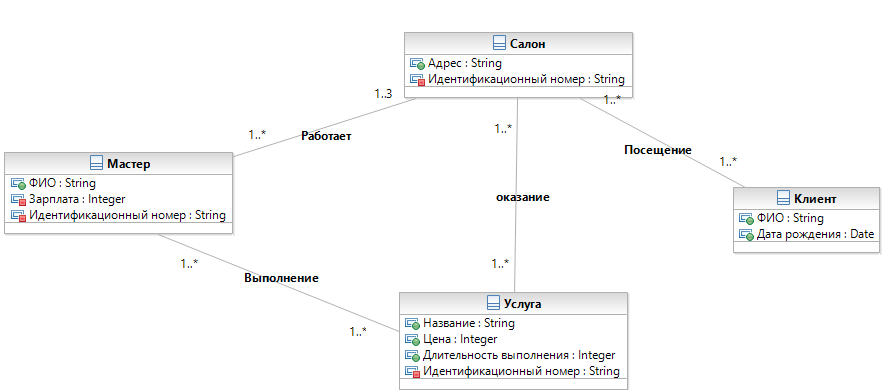

###Проект по курсу "Технологии разработки программных систем"

###Цель
Разработать программную систему, позволяющую вести учет клиентов и деятельности сети салонов
###Структура репозитория
* [Директория проекта VisualStudio](./ProjectSalon/)
* [Документация(диаграммы и отчеты)](./docs/)

###Диаграмма классов (первая итерация)

###Предметная область
* **СЕТЬ САЛОНОВ** – название, список салонов

* **САЛОН** – название, класс, [список услуг], адрес

* **КЛИЕНТ** – фамилия, имя, год рождения, дата посещения, список услуг, которыми воспользовался

* **РАБОТНИК САЛОНА** – должность, график работы, зарплата, время работы в сети

* **УСЛУГА** – тип услуги, цена, длительность выполнения, подробный список действий для оказания

###Функционал
#####Для сотрудников салона
Ввод данных и получение информации о клиентах с использованием расширенной клиентской базы

Обратная связь с клиентом (получение его мнения о услугах и персонале салона)

Анализ экономической эффективности салона, подробная статистика

#####Для руководителей сети салонов
Ведение статистики услуг и сотрудников филиалов, выполнение анализа на основе этих данных

Управление графиком работы сотрудников

Определение зарплаты сотрудника по дополнительным параметрам (переработка, премии)

Добавление информации о клиенте в единое хранилище

Анализ данных клиентов, формирование статистики

Формирование отчета по интервалу времени для одного или всех филиалов сразу

Анализ экономической эффективности сети, подробная статистика для всей сети и по каждому салону

#####Для клиентов
Формирование отчета по оказанным услугам по заданному интервалу времени

Создание списка рекомендованных услуг для клиента на основе статистики использования

Рассылка акций и спецпредложений клиентам на основе истории использования услуг
